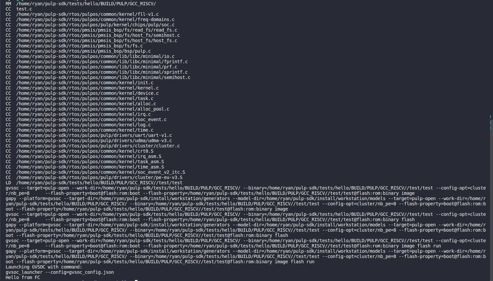
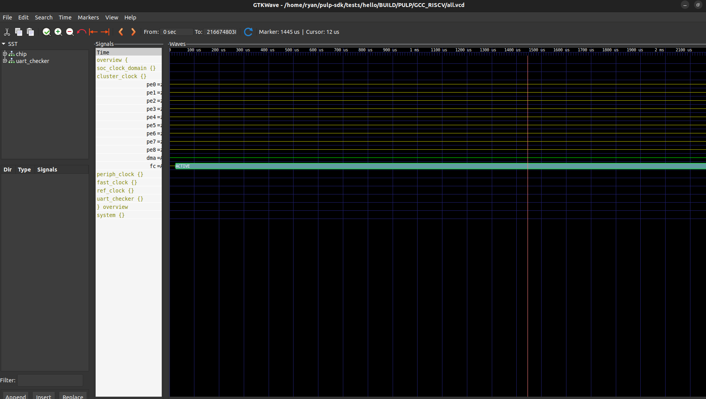

PULP Toolchain and SDK
-------------------------------

.. contents:: 
    :depth: 2
    
Introduction
~~~~~~~~~~~~~~~~~~~~~~~~~~~~

PULP (Parallel Ultra-Low Power) Platform is a holistic initiative aimed at developing energy-efficient 
parallel computing solutions. It encompasses various hardware and software components tailored for 
embedded and IoT applications, along with a vibrant community promoting collaboration and innovation. 
The hardware components include PULP cores and systems designed for minimal power consumption and 
optimized performance. On the software side, the platform supports operating systems, compilers, 
development tools, libraries, middleware, and frameworks to streamline application development. 
The open-source nature of PULP encourages innovation and knowledge-sharing, while educational 
resources empower developers to harness parallel computing for energy-efficient solutions. 
Overall, the PULP Platform provides a comprehensive ecosystem to foster the advancement of 
energy-efficient computing in diverse embedded and IoT domains.

PULP Toolchain installation
~~~~~~~~~~~~~~~~~~~~~~~~~~~~~~

Ubuntu version: 22.04.4

Open new terminal to create new directory:

.. code-block:: bash

    cd
    cd /opt
    sudo mkdir riscv
    cd riscv
    sudo mkdir bin

Setup path:

.. code-block:: bash

    nano ~/.profile

Add

.. code-block:: bash 

    if [ -d "/opt/riscv" ] ; then
        PATH="/opt/riscv:$PATH"
    fi

.. Note:: 

    This will require a logout / login to take effect

Open new terminal to install toolchain:

Prerequisite

.. code-block:: bash 

    sudo apt-get install autoconf automake autotools-dev curl libmpc-dev libmpfr-dev libgmp-dev gawk build-essential bison flex texinfo gperf libtool patchutils bc zlib1g-dev

Follow these steps to install toolchain:

.. code-block:: bash

    git clone https://github.com/pulp-platform/pulp-riscv-gnu-toolchain
    cd pulp-riscv-gnu-toolchain
    git submodule update --init --recursive

Cause ``/opt/riscv/bin`` is in ``root``, so must use ``sudo`` in ``make``

.. code-block:: bash

    ./configure --prefix=/opt/riscv --with-arch=rv32imc --with-cmodel=medlow --enable-multilib
    sudo make

PULP SDK installation
~~~~~~~~~~~~~~~~~~~~~~~~~~~

Open new terminal to install pulp-sdk

Prerequisite

.. code-block:: bash

    sudo apt-get install -y build-essential git libftdi-dev libftdi1 doxygen python3-pip libsdl2-dev curl cmake libusb-1.0-0-dev scons gtkwave libsndfile1-dev rsync autoconf automake texinfo libtool pkg-config libsdl2-ttf-dev

Follow these steps:

.. code-block:: bash

    pip install argcomplete pyelftools six
    pip install prettytable

Clone pulp SDK and update submodule:

.. code-block:: bash
    
    git clone https://github.com/pulp-platform/pulp-sdk.git
    cd pulp-sdk
    git submodule update --init --recursive

Edit file ``pulp-sdk/configs/pulp-open.sh``, put the command below under line 32

.. code-block:: bash

    export PULP_RISCV_GCC_TOOLCHAIN=/opt/riscv 

Build gvsoc

.. code-block:: bash

    source configs/pulp-open.sh
    make build

.. Note:: 

    Always run command ``source configs/pulp-open.sh`` to select board before running or doing anything in ``pulp-sdk`` directory

First simple test
~~~~~~~~~~~~~~~~~~~~~~~~~~~~~~~

Select board and then go to project

.. code-block:: bash

    cd pulp-sdk
    source configs/pulp-open.sh
    cd tests/hello

Build project

.. code-block:: bash

    make clean all run

The last line appear with ``Hello from FC`` without any error then you success.

Follow the command below to have gtkwave

.. code-block:: bash 

    make clean all run runner_args="--vcd"

This time ``view.gtkw`` with appear in project, as long as ``all.vcd`` in ``BUILD/PULP/GCC_RISCV`` folder.

.. image:: ../image/gtkwavex.png

Run the code below to see wave 

.. code-block:: bash

    gtkwave /home/ryan/pulp-sdk/tests/hello/BUILD/PULP/GCC_RISCV/all.vcd /home/ryan/pulp-sdk/tests/hello/view.gtkw

.. tip::

    To run other project outside pulp-sdk, just move project folder to path ``pulp-sdk/tests/`` and then run.

References
~~~~~~~~~~~~~~~~~~

`[1]. Installation toolchain and sdk <https://www.pulp-platform.org/docs/pulp_training/NBruschi_gvsoc_tutorial_part1.pdf>`_

