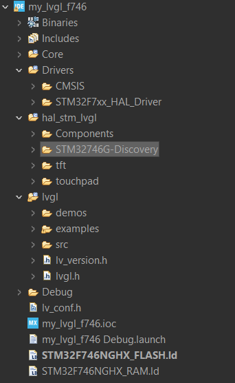

LVGL
==================

.. contents:: 
    :depth: 2

Board Stm32F746GDISCOVERY
----------------------------

Has on-chip RAM: 340Kb, on-chip flash: 1Mb, on board external SDRAM: 128Mb, 
on board external flash: 128Mb, on board LCD-TFT: 480x272

Calculate bytes of memory an image consumes
----------------------------------------------

Given: 
    * Resolution of bitmap image: 480x270
    * Pixel format: ARG88888

bpp: bit per pixel 

Total memory consumed = Width x Height x (bpp/8) = 480 x 270 x (32/8) = 506.25Kb

Bitmap image (BMP)
----------------------

* An BMP image contains uncompressed pixel data, so it consumes more space on disk.

* You can directly read the pixel values and display them on the display module.

Select pixel format for your application
-------------------------------------------

Depends on:

* Pixel format support by the LCD driver chip 

* Desired color range

* Microcontroller RAM space availability

* Microcontroller Flash space availability 

Porting library to STM32F746GDISCOVERY project
-------------------------------------------------

#. Create project with board STM32F746GDISCOVERY, but do not enable all default peripherals.

#. Set Debug to "Serial Wire".

#. Set High Speed Clock to "BYPASS Clock Source", and Low Speed Clock to "Crystal/Ceramic Resonator".

#. Enable these peripherals: I2C3, USART1, LTDC. 

#. If you use external SDRAM, you need to enable ``FMC/SDRAM1``, choose ``SDCKE0+SDNE0`` in ``Clock and chip enable``.

#. Then go to tab ``Project Manager``, choose ``Advanced Settings`` and untick ``Generate Code`` of these peripheral. 

#. In tab ``Clock Configuration``, set ``HCLK`` up to 216, just type this number and press enter then Cubeide will calculate for you. 

#. Create source folder ``hal_stm_lvgl`` 

#. Clone `sample project Stm32F746GDISCOVERY of LVGL github <https://github.com/lvgl/lv_port_stm32f746_disco>`_

#. Copy the two folders ``tft`` and ``touchpad`` from ``hal_stm_lvgl``, then paste them into ``hal_stm_lvgl`` source folder created earlier.

#. Copy the two folders ``Components`` and ``STM32746G-Discovery`` from ``Utilities``, then paste them into ``hal_stm_lvgl`` source folder created earlier.

#. Add path to all folder above.

#. Clone `LVGL github <https://github.com/lvgl/lvgl>`_

#. Copy ``lvgl`` cloned folder to your project.

#. Move ``lv_conf_template.h`` out side ``lvgl`` folder, and rename it to ``lv_conf.h``.

#. Open ``lv_conf.h`` and change **#if 0** to **#if 1** to enable content in this file.

#. Keep ``src`` folder, ``lv_version.h`` and ``lvgl.h``. Delete all the rest files and folders.

#. If you want to use example or demo, then keep ``demos`` and ``examples`` folder.

.. note:: 

    #. When building the project, you may encounter some errors in certain files from the ``STM32746G-Discovery`` folder. 
        This occurs because the peripheral is not enabled. Simply use **#if 0** and **#endif** to temporarily disable that file.
    
    #. The most important thing that will cause the screen to become unresponsive is the missing call to the function ``lv_tick_inc(1)``.
        You have to call this function in ``void SysTick_Handler(void)`` of the ``stm32f7xx_it.c`` file.

    #. I recommend using LVGL version 8.2 for enhanced stability. Because cannot use macro rotation display in version 9.3.0

Run lvgl example
-------------------

.. code:: c

    /* USER CODE BEGIN Includes */
    #include "lvgl/lvgl.h"
    #include "lv_conf.h"
    #include "tft.h"
    #include "touchpad.h"
    #include "lv_examples.h"

    /* USER CODE END Includes */

        int main(void)
    {

    /* USER CODE BEGIN 1 */

    /* USER CODE END 1 */

    /* MCU Configuration--------------------------------------------------------*/

    /* Reset of all peripherals, Initializes the Flash interface and the Systick. */
    HAL_Init();

    /* USER CODE BEGIN Init */

    /* USER CODE END Init */

    /* Configure the system clock */
    SystemClock_Config();

    /* USER CODE BEGIN SysInit */

    /* USER CODE END SysInit */

    /* Initialize all configured peripherals */
    MX_GPIO_Init();
    /* USER CODE BEGIN 2 */
    /* Enable I-Cache */
    SCB_EnableICache();

    /* Enable D-Cache */
    SCB_EnableDCache();

    lv_init();
    tft_init();
    touchpad_init();

    lv_example_dropdown_1();
    /* USER CODE END 2 */

    /* Infinite loop */
    /* USER CODE BEGIN WHILE */
    while (1)
    {
        HAL_Delay(5);
        lv_task_handler();
        /* USER CODE END WHILE */

        /* USER CODE BEGIN 3 */
    }
    /* USER CODE END 3 */
    }