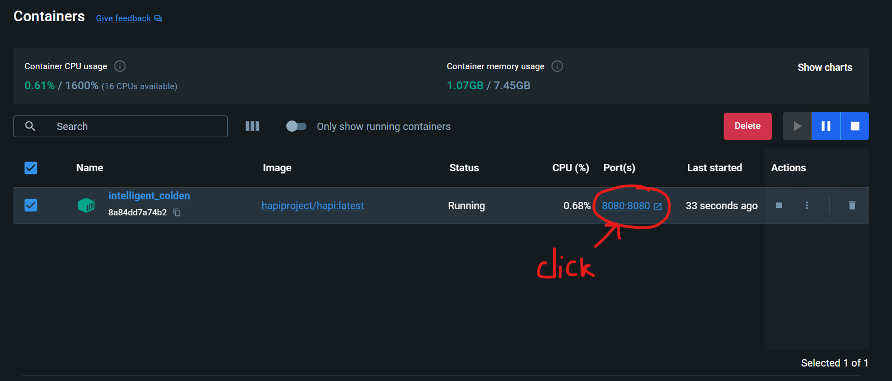
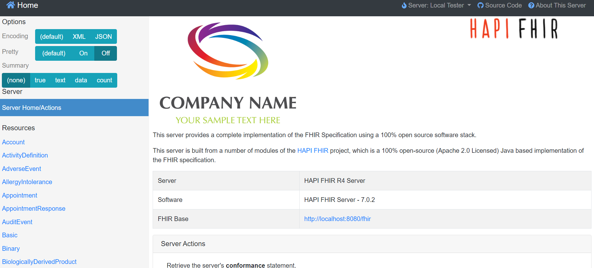

Docker
============

Installation
-----------------

`Docker for window <https://www.docker.com/products/docker-desktop/>`_

Create container
--------------------

Create a container for Hapi server to run on localhost

.. code-block:: docker

    docker pull hapiproject/hapi:latest
    docker run -p 8080:8080 hapiproject/hapi:latest

.. image:: image/docker1.png

Select the container and hit start button

.. image:: image/docker2.png

Click ``8080:8080`` to open Hapi server on localhost.

Download OpenMRS
----------------------

`Web page OpenMRS <https://openmrs.org/>`_

Choose ``Standalone Edition``

`Link download OpenMRS <https://openmrs.org/download/>`_