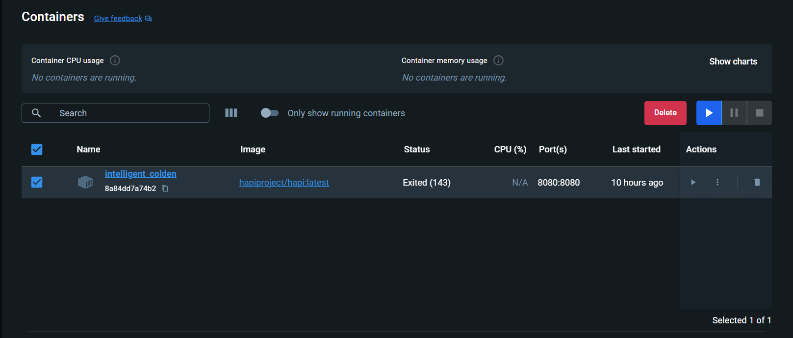
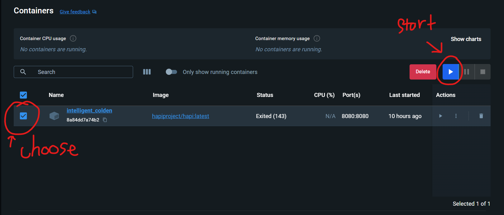

Docker
============

Installation
-----------------

`Cài đặt docker cho window <https://www.docker.com/products/docker-desktop/>`_

Create container
--------------------

Crate a container for hapi server to run on localhost

.. code-block:: docker

    docker pull hapiproject/hapi:latest
    docker run -p 8080:8080 hapiproject/hapi:latest

Select the container and hit start button

