GPS NEO-9M
=========================

.. contents::
    :depth: 2

Configuration
-------------------

Use app Ucenter
~~~~~~~~~~~~~~~~~~

`Link download <https://content.u-blox.com/sites/default/files/2024-06/u-centersetup_v24.05.zip>`_

Follow the connection below

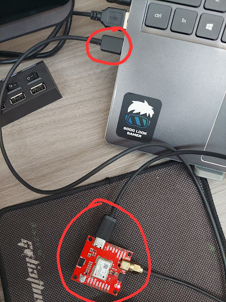

Follow steps below to change baudrate of UART1 to 112500

Open Ucenter and connect to gps NEO-9M

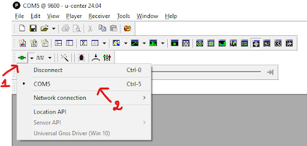

On Toolbar, choose View -> Generation 9 Configuration View to open ``configuration window``

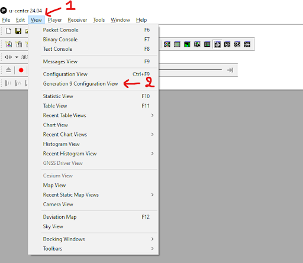

Then choose Advanced Configuration

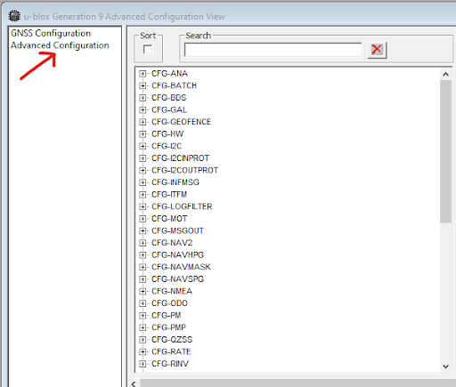

Choose CFG-UART1 -> CFG-UART1-BAUDRATE

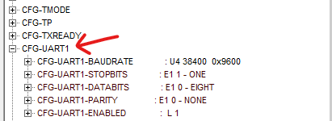

In value field change 38400 to 115200, then select Set in RAM and Set in BBR

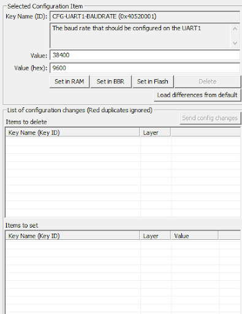

Then select ``Send config changes``

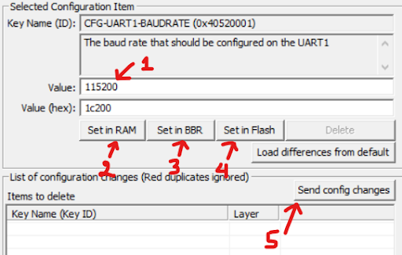

.. note:: 

    All steps above can be applied for all your wanted configuration 

To disable others unwanted message, go to ``CFG-MSGOUT``

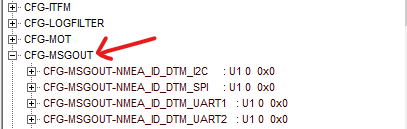

.. note:: 
    
    Change the value from 1 to 0 to disable unwanted message

Disable CFG-MSGOUT-NMEA_ID_GGA_UART1

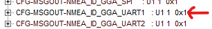

Disable CFG-MSGOUT-NMEA_ID_GSA_UART1

Disable CFG-MSGOUT-NMEA_ID_GSV_UART1

Disable CFG-MSGOUT-NMEA_ID_RMC_UART1

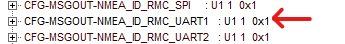

Disable CFG-MSGOUT-NMEA_ID_VTG_UART1

Disable CFG-INFMSG-NMEA_UART1 và CFG-INFMSG-NMEA_USB

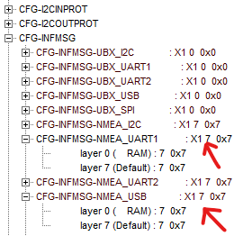

Untick some options below for UART1 and USB. Then follow configuration steps above.

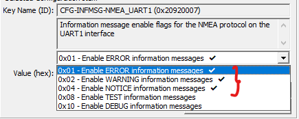

The result:

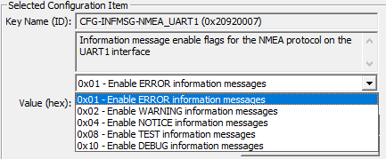

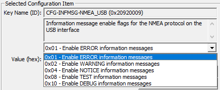

Use command through Hercules
~~~~~~~~~~~~~~~~~~~~~~~~~~~~~~

Connect Tx pin of module UART(USB to TTL CP2102) with pin Rx of module GPS. Connect pin 3V3 and GND of module UART with pin 3V3 and GND of module GPS.

.. list-table:: List of commands
    :widths: 2 2 2
    :header-rows: 1

    * 
      - UBX-CFG_VALSET message
      - Ram layer config
      - BBR layer config

    * 
      - Set baudrate 115200
      - b5 62 06 8a 0c 00 00 02 00 00 01 00 52 40 00 c2 01 00 f4 b0
      - b5 62 06 8a 0c 00 00 01 00 00 01 00 52 40 00 c2 01 00 f3 a5

    * 
      - Disable GLL msgout
      - b5 62 06 8a 09 00 00 02 00 00 ca 00 91 20 00 16 1e
      - b5 62 06 8a 09 00 00 01 00 00 ca 00 91 20 00 15 16

    * 
      - Enable GLL msgout
      - b5 62 06 8a 09 00 00 02 00 00 ca 00 91 20 01 17 1f
      - b5 62 06 8a 09 00 00 01 00 00 ca 00 91 20 01 16 17

    * 
      - Disable GGA msgout
      - b5 62 06 8a 09 00 00 02 00 00 bb 00 91 20 00 07 d3
      - b5 62 06 8a 09 00 00 01 00 00 bb 00 91 20 00 06 cb

    * 
      - Disable GSV msgout
      - b5 62 06 8a 09 00 00 02 00 00 c5 00 91 20 00 11 05
      - b5 62 06 8a 09 00 00 01 00 00 c5 00 91 20 00 10 fd

    * 
      - Disable RMC msgout
      - b5 62 06 8a 09 00 00 02 00 00 ac 00 91 20 00 f8 88
      - b5 62 06 8a 09 00 00 01 00 00 ac 00 91 20 00 f7 80

    * 
      - Disable VTG msgout
      - b5 62 06 8a 09 00 00 02 00 00 b1 00 91 20 00 fd a1
      - b5 62 06 8a 09 00 00 01 00 00 b1 00 91 20 00 fc 99

    * 
      - Disable CFG-INFMSG-NMEA_UART1
      - b5 62 06 8a 09 00 00 02 00 00 07 00 92 20 00 54 52
      - b5 62 06 8a 09 00 00 01 00 00 07 00 92 20 00 53 4a

    * 
      - Disable CFG-INFMSG-NMEA_USB
      - b5 62 06 8a 09 00 00 02 00 00 09 00 92 20 00 56 5c
      - b5 62 06 8a 09 00 00 01 00 00 09 00 92 20 00 55 54

Follow steps below to change baudrate of UART1 to 112500

Copy and paste commands to send box of Hercules and tick ``HEX`` box.

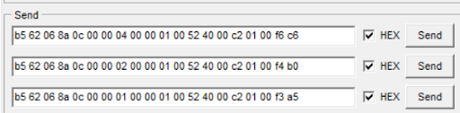

Then select send sequently and have the result below

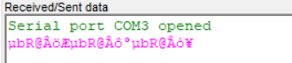

.. note:: 

    All steps above can be applied for all your wanted configuration 