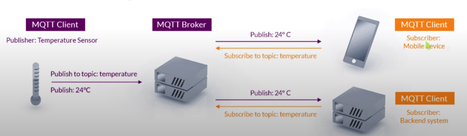
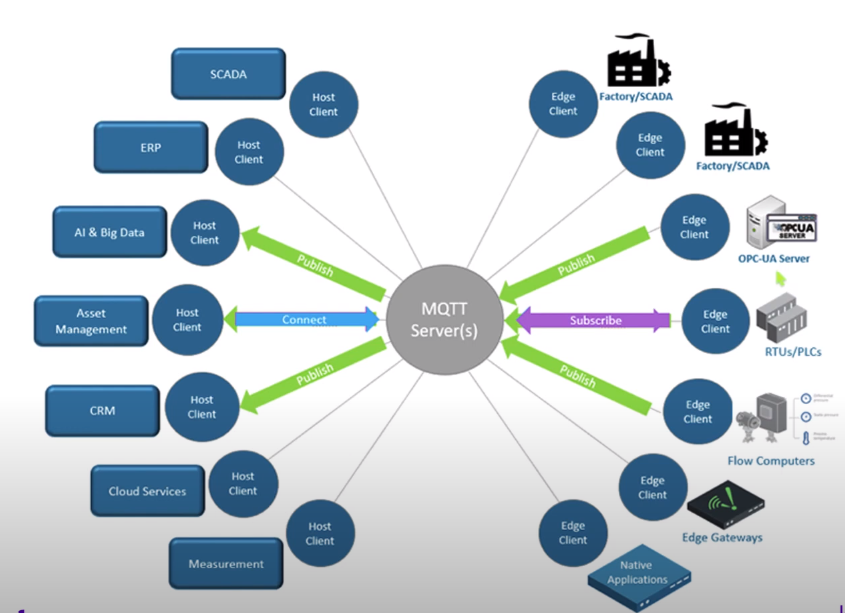

MQTT
====

.. contents:: 
    :depth: 2

Viết ví dụ và tutorial giải thích chi tiết cách dùng board STM32F7 giao tiếp với cảm biến DHT11 để lấy nhiệt 
độ, độ ẩm và push lên nền tảng Thingsboard

Giới thiệu
-----------

MQTT (MQ Telemetry Transport) là giao thức nhắn tin xuất bản/đăng ký nhẹ được tối ưu hóa cho các cảm biến nhỏ và thiết bị di động.

Cách thức hoạt động
--------------------

MQTT là một trong những giao thức được sử dụng phổ biến nhất liên quan đến IOT. MQTT cho phép các thiết bị IOT hạn 
chế về tài nguyên gửi hoặc xuất bản thông tin về một chủ đề nhất định tới một máy chủ có chức năng như message broker MQTT.

Thingsboard
----------------

ThingsBoard là một nền tảng IoT mã nguồn mở để giám sát, xử lý dữ liệu, trực quan hóa dữ liệu cùng với quản lý thiết bị.

Nó hỗ trợ các giao thức IoT tiêu chuẩn công nghiệp - MQTT, CoAP và HTTP. ThingsBoard kết hợp khả năng mở rộng, khả năng 
chịu lỗi và hiệu suất để thu thập dữ liệu thiết bị để xử lý và giám sát. Nó cung cấp gateway server có thể giao tiếp với 
các thiết bị đính kèm.

DHT11
-----

Request - Response - Data reading

**Request** 

Chế độ output, 