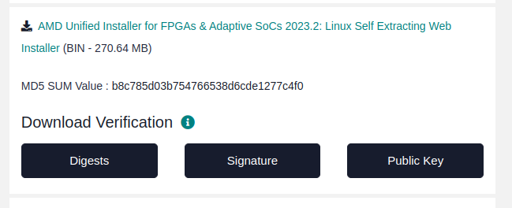

Vivado
=====================

.. note::

    **This installation instruction is a shortened version of the full instructions provided by the author referred below**

Installation 
----------------------

Dependencies
~~~~~~~~~~~~~~~~~~~~~~~~~

If you have not previously installed any versions of Vivado on your machine, be sure to add the 32-bit architecture 
and changing the system shell from dash to bash:

.. code-block:: bash

    sudo dpkg-reconfigure dash

    sudo dpkg --add-architecture i386

It is theoretically possible to install all of these package dependencies at once in a single 
command line of apt-get install. However, I've found the best chance of avoid weird issues 
is to use the following sequence:

.. code-block:: bash

    sudo apt-get install gparted xinetd gawk gcc net-tools ncurses-dev openssl libssl-dev flex bison xterm autoconf libtool texinfo zlib1g-dev

    sudo apt-get install iproute2 make libncurses5-dev tftpd libselinux1 wget diffstat chrpath socat tar unzip gzip python3 tofrodos lsb libftdi1 libftdi1-2
    
    sudo apt-get install lib32stdc++6 libgtk2.0-0:i386 libfontconfig1:i386 libx11-6:i386 libxext6:i386 libxrender1:i386 libsm6:i386 tree openssh-server

    sudo apt-get install debianutils iputils-ping libegl1-mesa libsdl1.2-dev pylint python3 cpio tftpd-hpa gnupg zlib1g:i386 haveged perl xvfb

    sudo apt-get install gcc-multilib build-essential automake screen putty pax g++ python3-pip xz-utils python3-git python3-jinja2 python3-pexpect
  
    sudo apt-get install liberror-perl mtd-utils xtrans-dev libxcb-randr0-dev libxcb-xtest0-dev libxcb-xinerama0-dev libxcb-shape0-dev libxcb-xkb-dev

    sudo apt-get install util-linux sysvinit-utils google-perftools patch diffutils ocl-icd-libopencl1 opencl-headers ocl-icd-opencl-dev

    sudo apt-get install libncurses5 libncurses5-dev libncursesw5:amd64 libncursesw5-dev libncurses5:i386 libtinfo5 libstdc++6:i386 libgtk2.0-0:i386 dpkg-dev:i386

Install Cython

.. code-block:: bash

    pip install cython

    sudo apt update
    sudo apt upgrade

.. note:: 

    If prompt show this:

        Defaulting to user installation because normal site-packages is not writeable
        
        Requirement already satisfied: cython in ./.local/lib/python3.10/site-packages (3.0.10)
    
    The output you provided indicates that Cython is already installed on your system!

USB Port Access for User
~~~~~~~~~~~~~~~~~~~~~~~~~~

If you have been using USB devices already with your Ubuntu installation this step can be skipped. 
However, a fresh install of Ubuntu needs to have you user added to the dial out group so Vivado can access the USB ports of the machine:

.. code-block:: bash

    sudo adduser $USER dialout

Download Vivado
~~~~~~~~~~~~~~~~~~~~~~~~~

Go to `Vivado <https://www.xilinx.com/support/download.html>`_ to get download link 

Select version of the installer below and log in with your AMD website credentials when prompted. Provide you information as necessary and click download.

Then you have file ``FPGAs_AdaptiveSoCs_Unified_2023.2_1013_2256_Lin64.bin``

Invoke commands below

.. code-block:: bash

    chmod +x FPGAs_AdaptiveSoCs_Unified_2023.2_1013_2256_Lin64.bin

    sudo ./FPGAs_AdaptiveSoCs_Unified_2023.2_1013_2256_Lin64.bin

The GUI for installation will appear. Follow it to complete the installation process. 

.. note::

    #. Select Vivado Enterprise 

    #. If your capacity is not much, just select kintex7 and its stuff
    
    #. In this instruction, I select ``/home`` to store my installation.

Close the ``Xilinx Information Center`` window to exit.

To run vivado, just invoke commands below

.. code-block:: bash

    source  /home/Vivado/2023.2/settings64.sh

    vivado

Add vivado to path

.. code-block:: bash

    export PATH=$PATH:/path/to/vivado/bin

Get trial license
~~~~~~~~~~~~~~~~~~~

Run vivado then go to ``Help``, select ``Manage license`` and tick ``trial 30 days`` and ``Process now``. 
A window will appear, just follow steps and get the license.

Uninstall Vivado
--------------------------

First go to your Xilinx instalation folder, then look for xsetup binaries:

.. code-block:: bash

    <Xilinx_installation_folder>$ find . -name xsetup

Outputs would correspond to all installed Xilinx application and their xsetup binaries.

For the Xilinx application you want to Uninstall, go to the folder where xsetup is located for that application and run:

.. code-block:: bash

    <Xilinx_program_you_want_to_delete_folder>$ sudo ./xsetup -Uninstall

References
-----------------------

`[1]. Vivado, Vitis, & PetaLinux 2023.2 Install on Ubuntu by Whitney Knitter <https://www.hackster.io/whitney-knitter/vivado-vitis-petalinux-2023-2-install-on-ubuntu-2f1b98>`_

`[2]. Step-by-Step Guide: Installing Vivado 2022.1 ML Edition on Ubuntu 20.04 Linux and Windows 10 <https://www.youtube.com/watch?v=QoMBkR5Rheg&ab_channel=TechSimplifiedTV>`_
